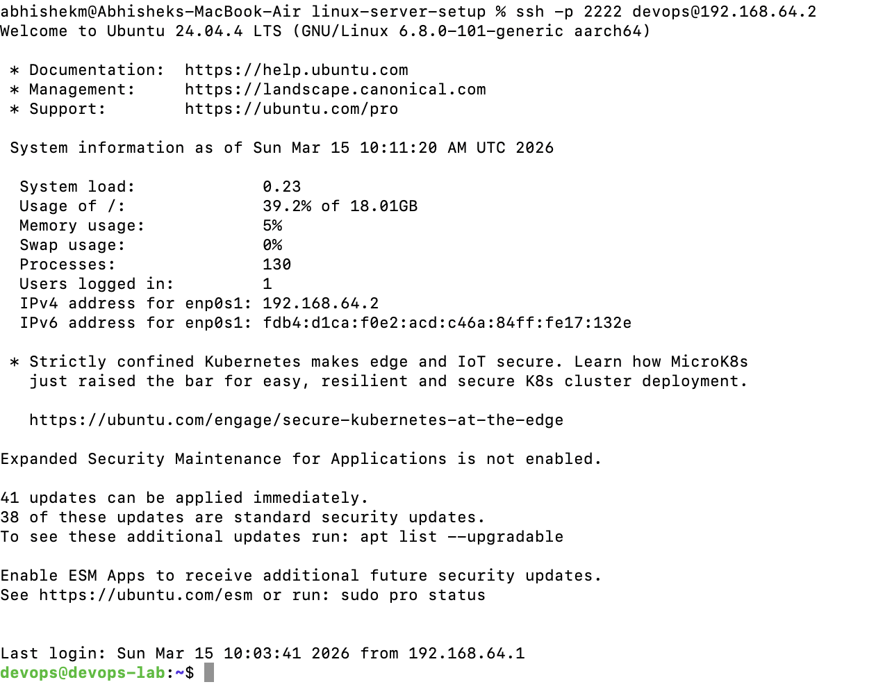
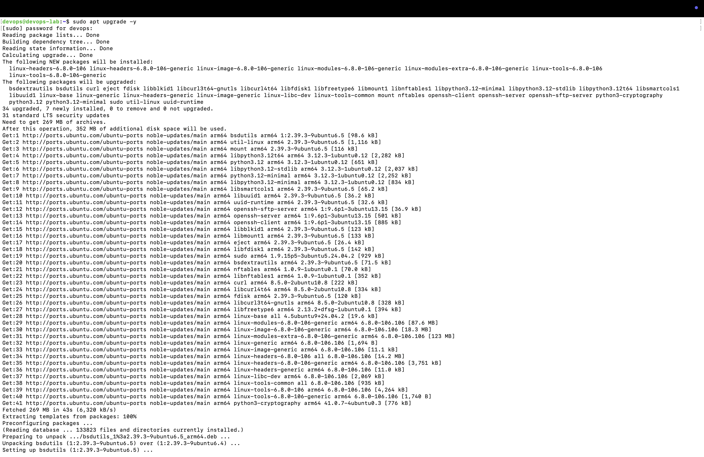
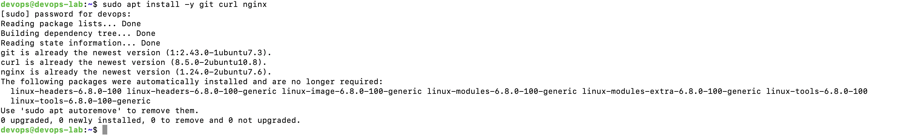
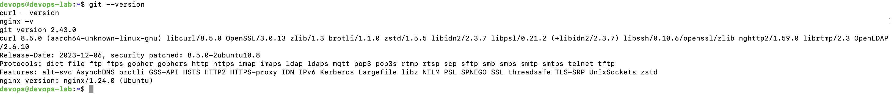
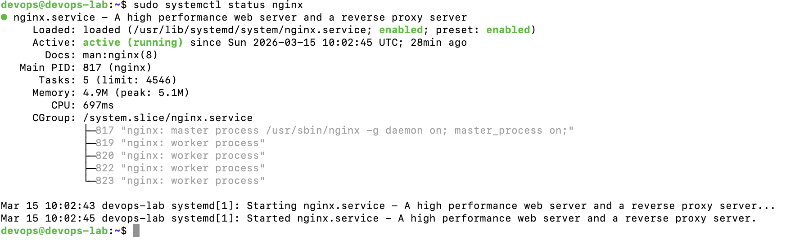
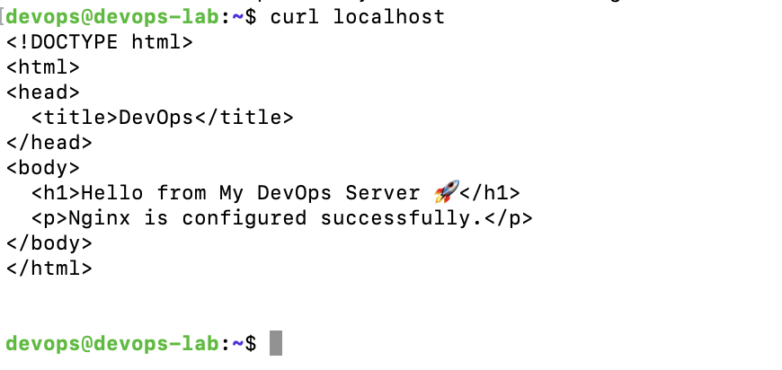
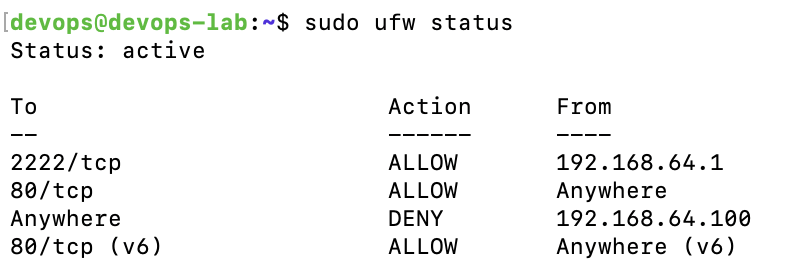
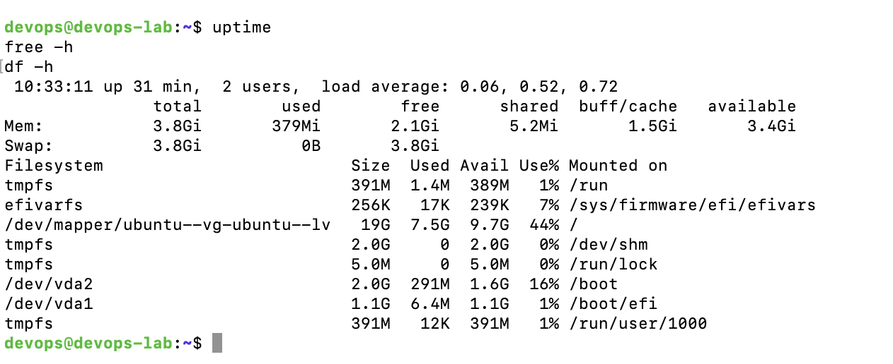

## Automation Script

The server setup can be automated using the `setup.sh` script.

Run the script:

```bash
chmod +x setup.sh
./setup.sh


## Screenshots

### Step 1 – SSH Login


### Step 2 – Update Packages


### Step 3 – System Upgrade


### Step 4 – Install Tools


### Step 5 – Git Version Check


### Step 6 – Nginx Version


### Step 7 – Nginx Service


### Step 8 – Curl Localhost


### Step 9 – Firewall Rules


### Step 10 – System Health

