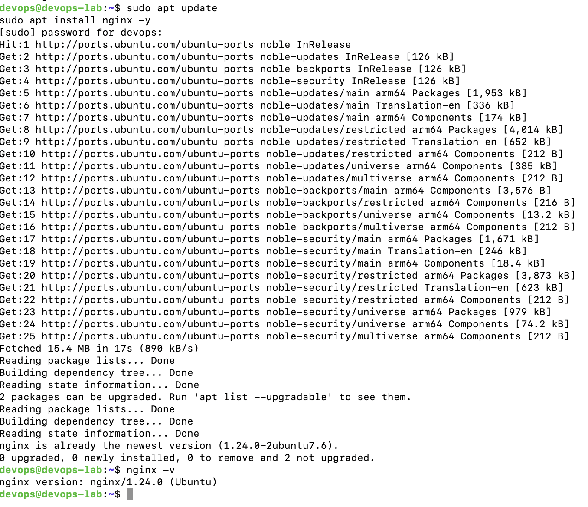
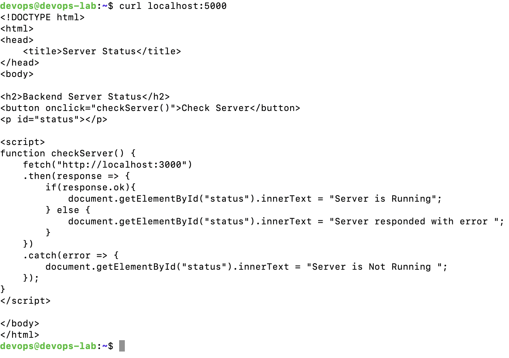
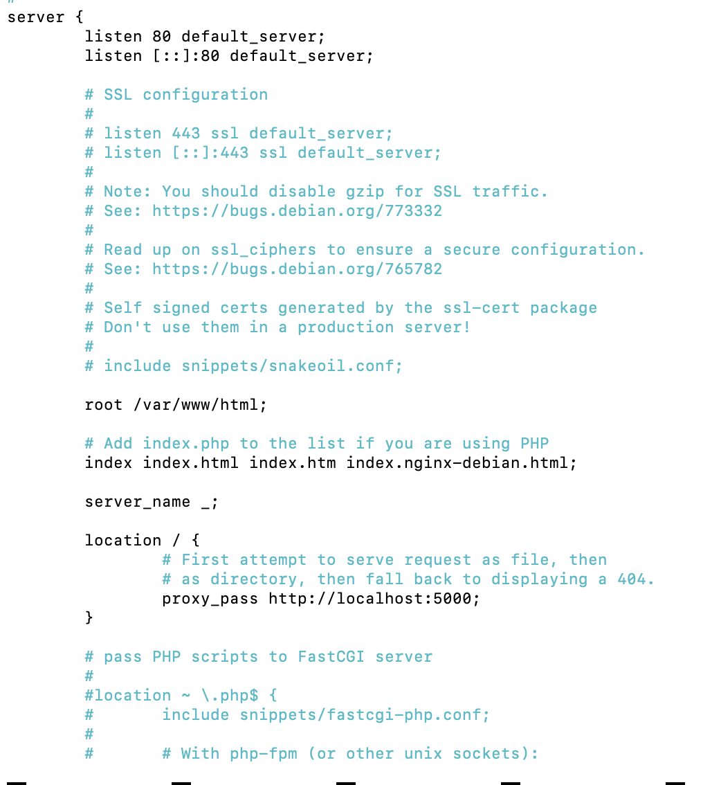
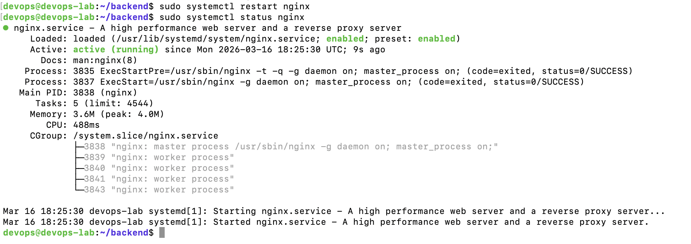
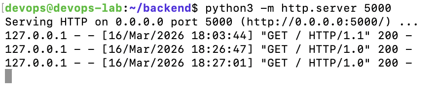

# NGINX Reverse Proxy Setup

This project demonstrates how to configure NGINX as a reverse proxy to forward requests to a backend server.

## Architecture

Client → NGINX → Backend Server

## Technologies Used

- Linux (Ubuntu)
- NGINX
- Python HTTP Server

## Steps Performed

1. Installed NGINX
2. Created backend server using Python
3. Configured NGINX reverse proxy
4. Restarted NGINX service
5. Tested reverse proxy functionality

## Screenshots

### NGINX Installation

### Backend Server

### NGINX Configuration

### Restart NGINX

### Reverse Proxy Test

